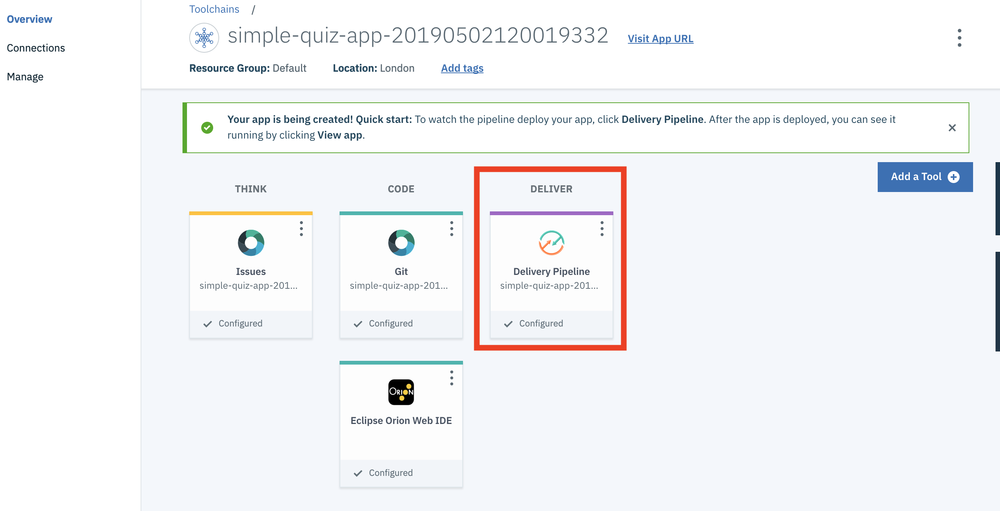
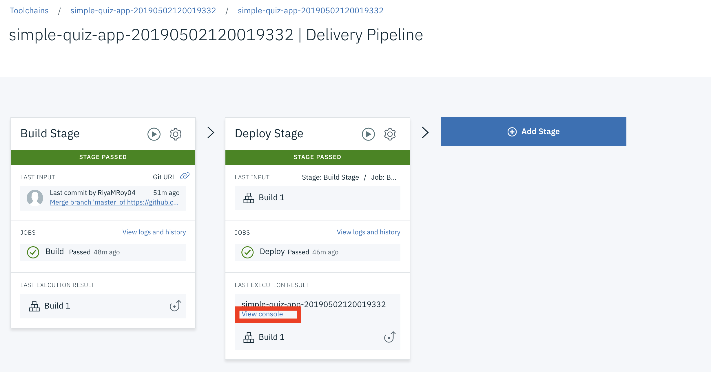
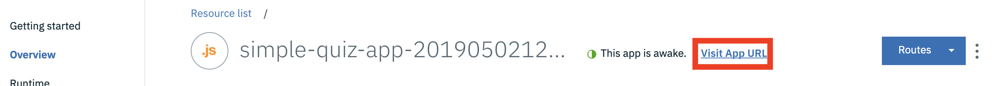
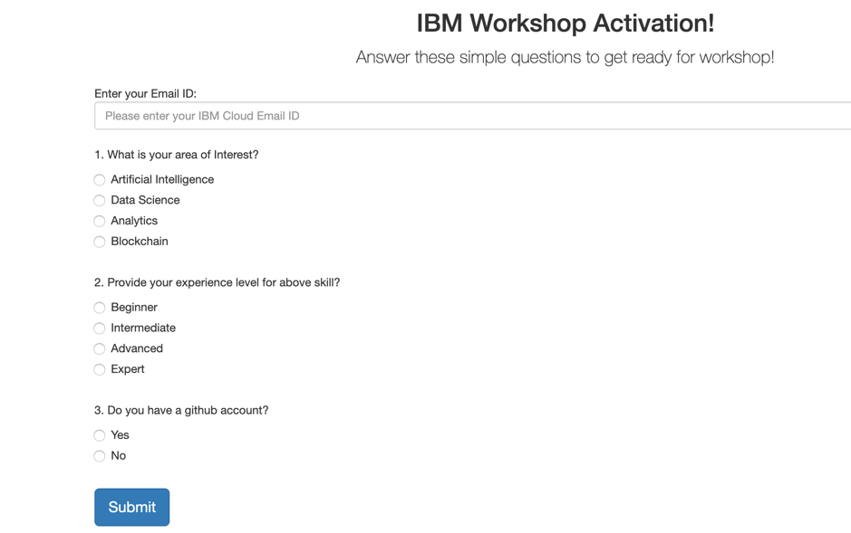

# Deploy simple application and submit the Questionnaire

[Deploy to IBM Cloud](https://cloud.ibm.com/devops/setup/deploy?repository=https://github.com/sudharshan-govindan/skill-app.git)

1. Press the above `Deploy to IBM Cloud` button and then...

   * Click `Delivery Pipeline` icon.
   * Click `Create+` to create an IBM Cloud API Key.
   * Select your region, organization, and space (or use the defaults).
   * Click `Create` on top right corner to create a ToolChain.

2. In Toolchains, click on `Delivery Pipeline` to watch while the app is deployed.

   

3. Click on `View Console` in the Deploy stage

   

4. Once deployed, the app can be viewed by clicking `Visit App URL`

   

5. Attempt the Questions in the deployed app and submit the questionnaire!

   
