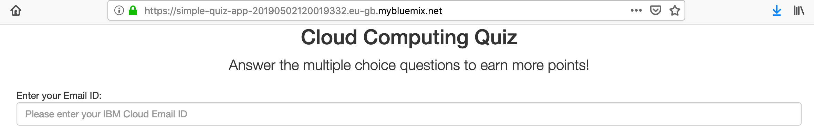

# Deploy simple Quiz application and take the quiz

[Deploy to IBM Cloud](https://cloud.ibm.com/devops/setup/deploy?repository=https://github.com/RiyaMRoy04/simple-quiz-app.git)

1. Press the above `Deploy to IBM Cloud` button and then...

   * Click `Create+` to create an IBM Cloud API Key.
   * Select your region, organization, and space (or use the defaults).
   * Click `Deploy`.

2. In Toolchains, click on `Delivery Pipeline` to watch while the app is deployed. 

   
   
3. Click on `View Console` in the Deploy stage
   
   
   
4. Once deployed, the app can be viewed by clicking `Visit App URL`

   

5. Attempt the Quiz in the deployed app and submit the response to view your score!

   
